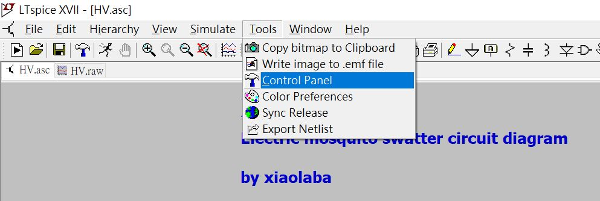
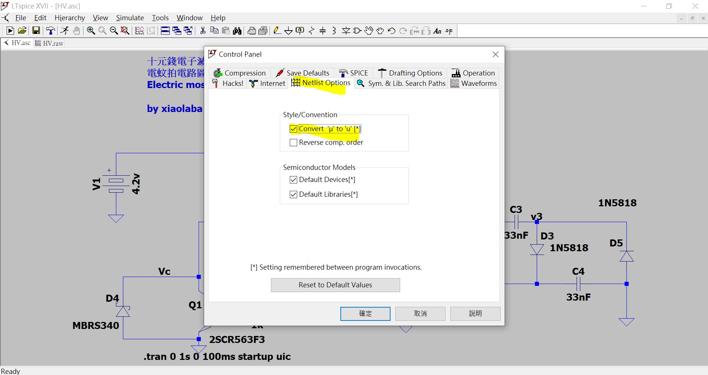
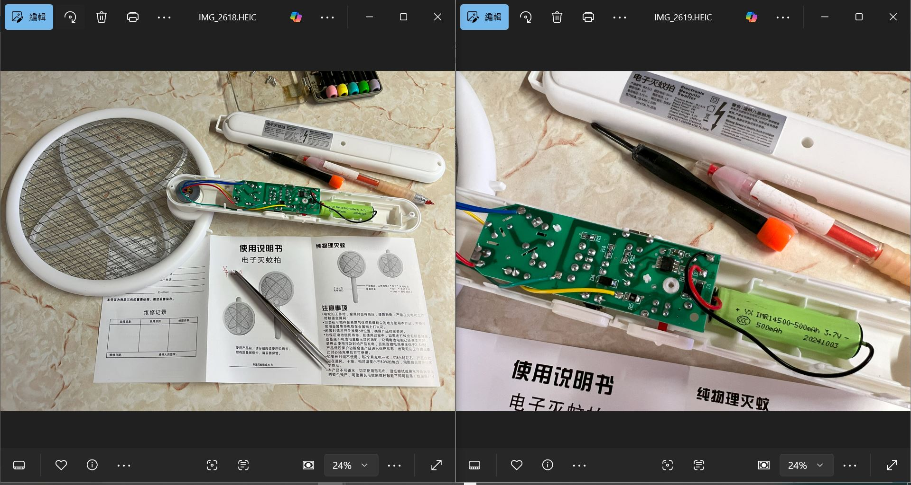
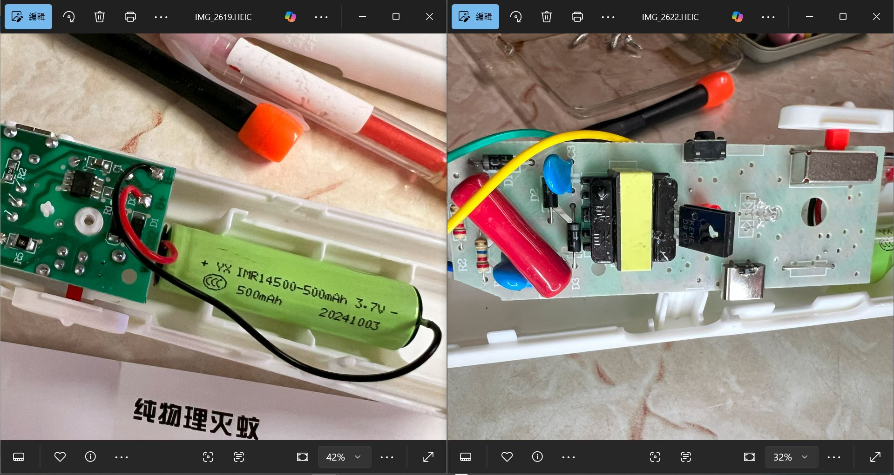
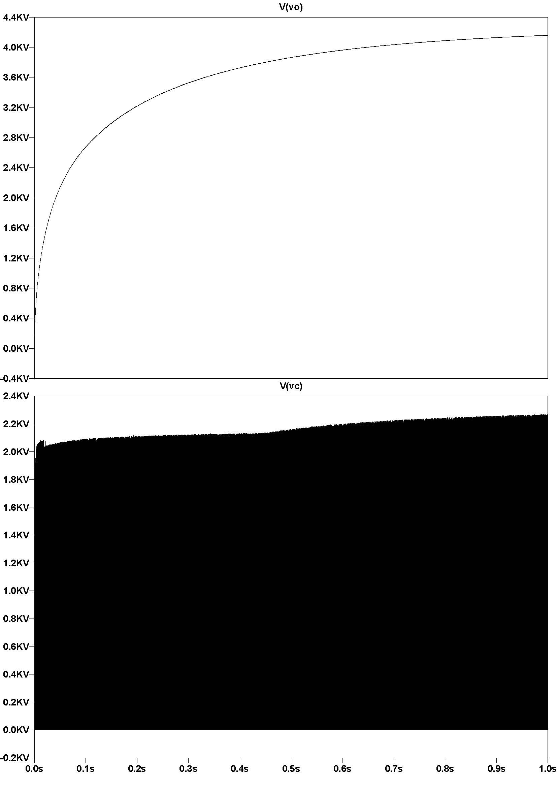
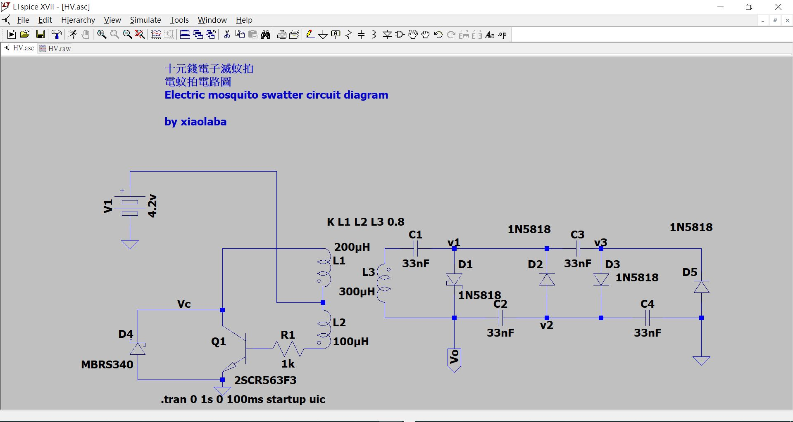
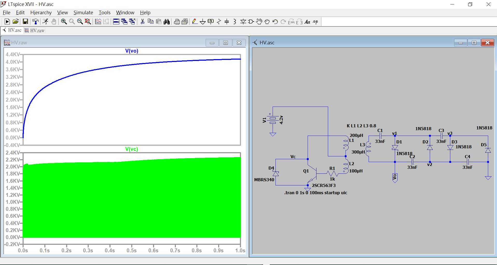

# LTspice_Electric_mosquito_swatter_circuit_diagram
LTspice 電蚊拍電路圖 Electric mosquito swatter circuit diagram 

LTspice source code UTF16 version [HV.asc](HV.asc)   
micro sumbol hardcoded as 'u' for easy platform/OS compatiblity.  
how to do that, 
    
  

### the DUT  
    
    

### simulation and plot  
   

### the schematic
    
    
    
    
    

